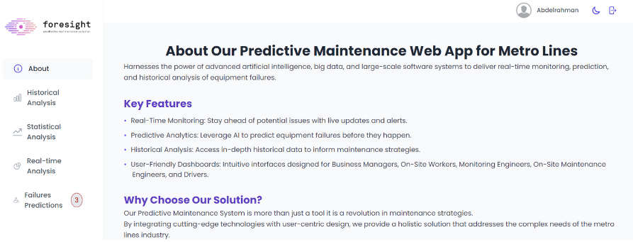

# Foresight Graduation Project

## Table of contents

- [Overview](#overview)
- [Sections](#sections)
- [Author](#author)

## Overview

- Display pressure sensors and their relation and failures data in the dashboard by line, box, and area charts.
- When a failure is predicted we will show the details of it in tables.
- View the T-statistics and P-value of the 3 failures for every pressure sensor.

## sections

### About

- provide an in-depth overview of the project, its objectives, and the benefits we aim to achieve.
- It explains the purpose of the project, highlighting the key goals.
- Introduces the team behind the project.

### Historical Analysis

- The charts show the pressure sensors’ value in a certain period, and the relation between its and failures.
- Show the minimum, maximum, average, and standard division for the Pressure sensors.

### Statistical Analysis:

- Detailed table that displays the T-Statistic and P-Value for Failure1, Failure2, and Failure3 for each pressure sensor.
- This analysis helps in identifying statistically significant factors that contribute to failures, allowing us to focus on the most critical areas for intervention.

### Real-Time Analysis

- Sensor logs involve continuously monitoring and displaying data captured by various sensors.
- This process is visualized using dynamic line and area charts.
- The charts refresh automatically as new data is received from the sensors, ensuring that the displayed information is always up-to-date.

### Failures predictions

- The admin doesn't need to check the Failures Predictions section every 6 hours to ensure if any failure or not, because when any failure exists we view the number of failures next to the section in the sidebar.
- When a failure is found we will show it inside the table containing the type of failure, timestamp, and the Pressure Sensor value.

### Built with

- React
- JavaScript
- Styled component
- Dark mode
- Apex-Chart

## Author

- (React | React Native) Developer - [Mostafa Hamdy](https://www.linkedin.com/in/mostafa-7amdy/)
- Data Engineer - [Ahmed Abdelnaser](https://www.linkedin.com/in/ahmed-abdelnasser-sayed)
- Backend Developer - [Shihab Mahmoud](https://www.linkedin.com/in/shihab-mahmoud-20a98b1b9/)
- Data scientist - [Ahmed Saeed](https://www.linkedin.com/in/ahmed-saeed-436124216/)
- Software Engineer - [Abdelrahman Essam](https://eg.linkedin.com/in/abdelrahman-essam-4bb756252)
- Data Engineer - [Khalid Mohammed](https://www.linkedin.com/in/khalid-mohammed-763ba019b/)
